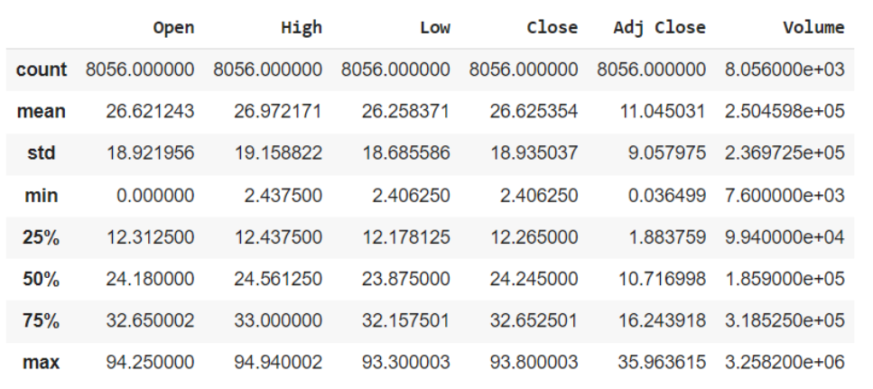
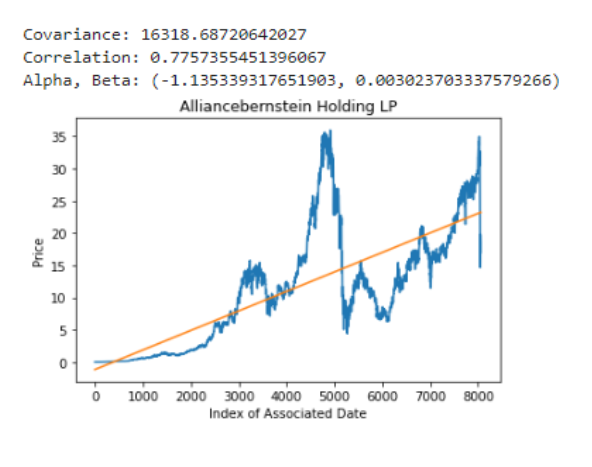
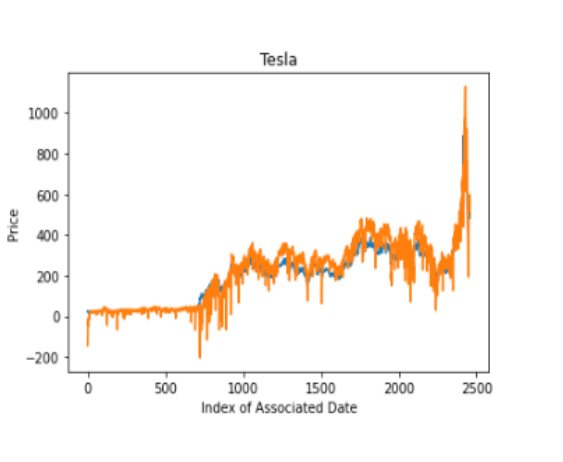

# Project Report
Vincent Cinardo, Aron Shrestha, Dhyeykumar Kansagara
Group 5 - Market Genie
Pantelis Monogioudis
CS 301 - 104 Introduction to Data Science
April 4, 2022
Ubiquant Market Prediction

## Abstract
We will implement an algorithm with multiple regression and batch gradient descent to find the equation of any particular stock market of our choosing. The general idea is that we hypothesize the existence of some equation for the model based on its features (categories of data). Multiple regression and gradient descent will allow us to find how much weight each feature holds by incrementing or decrementing them according to the gradient. Our results include a working linear regression model that predicts the future stock price. With the use of gradient descent as our loss function, we were able to optimize our training model and get a more accurate prediction plot.
 
## Introduction
A lucrative method of earning income is to invest into the stock market; exploiting trends using one's own knowledge of current events or patterns. Successful investing is not particularly easy. Even the most experienced investors will often lose money from an investment, usually buying  and losing in manageable amounts in relation to their buying power. It is a general rule of thumb to net positive income over 50% of the time. In the modern era, ‘statistical trading’ has become a common practice in the world of stock brokerage. Traders are able to gather more data than ever and use it to their advantage. With that in mind, our team has decided on a data science approach to the issue of predicting stock market trends. It is important because if a successful model is produced, an investor can increase their success rate, minimizing their losses and maximizing their gains. With that said, the name of our company is Market Genie. We provide predictive analysis solutions for investors. Here we implement a tool to predict a market of the user’s choosing. Our customer can choose features as inputs that they suspect will affect the market in ways that can be modeled. The program then takes the historical data of that stock and produces an equation for the user to use in the future. We believe that our implementation is fairly consistent in its predictions.

## Related Work
In the scientific journal, “Stock Price Trend Prediction Using Multiple Linear Regression '', multiple linear regression is used to model the trends of APPLE INC.’s stock and used root mean squared error to gauge its performance. The uncertainty of the returns could be mitigated by accurately predicting the stock prices and this could be done by identifying their fluctuations in advance. A prediction model that takes multiple factors is needed to do so (Shakhla et al. 2018). Their model calculated a linear relation between the dependent variable and every other independent variable. Furthermore, they removed the complexity by squaring the deviations. 

Another paper shares the methods to reduce the risk prediction with machine learning and deep learning algorithms. It it, authors compared nine machine learning models and two deep learning methods. Nabipour and others used ten technical indicators as their input values. They used two ways to employ them, firstly calculating the indicators by stock trading values and secondly by converting indicators to binary data before using it. After the prediction of each model, they found out that continuous data, RNN and LSTM outperforms other prediction models.

Our paper is very much similar to the first paper discussed in this section. Our paper is divided into three parts. In the first part we used a couple of mathematical formulas to come up with a best fit line for the plot of our data. Additionally, we used mean square error as our loss function. In the second part, we used jax to implement gradient descent and get the best fit line for the plot of our data. Eventually in the third part, we tried to get more accurate results with the use of a multiple-linear regression model. All the three parts were divided into training and testing criteria and loss functions were used in all the testing criterias. 

## Data 
The data that we will be using in our experimentation is from a stock called
Alliancebernstein Holding LP.

For the simple linear regression, we used the date as our input x and the adjusted close for our predictions. For the multiple linear regression, we used the open, close, and volume for inputs x1, x2, and x3 respectively.  As far as preprocessing goes, the data was downloaded directly from a kaggle dataset as a directory filled with csv files. From there it was converted into a pandas dataframe which made it easily accessible in Python from there.

## Methods
It is important to understand the statistics and calculus behind our implementation.
Simple linear regression describes how an independent variable affects a dependent variable linearly. The equation itself is linear and follows the form: y = mx + b. For comparison, the equation of simple linear regression is y = α + Βx. The slope β and constant α minimize the error within the relationship between x and y. What is meant by error?
 
When we make a prediction about the values of α and β in our program, more than likely we are quite a bit off. In other words, we have not arrived at the minimum amount of error possible. Assuming we are off, for each point yᵢ = α + βxᵢ + εᵢ, there is some error εᵢ. 
 
The error can be represented like this:
εᵢ = yᵢ - α - βxᵢ
 
The error at every value yᵢ is squared, then they are all summed together. To simply sum without squaring would not reflect the error accurately since negative numbers detract from the actual error. Also, by squaring the error at a point we uncover particularly large errors. We want to accurately represent the total difference between all predictions y from actual values. The goal is to minimize this error ε as much as possible. The process of using ε to find β and α is called the least squares fit. This is achieved by using the correlation between x and y as β. We then take the resulting β, the mean of x, and the mean of y to get the intercept α = ȳ - βx̄. How β and α are found will be explained further.
 
Correlation is the measure to what extent two variables are linearly related. The equation in is the covariance of x and y, divided by the product of the standard deviation of each respective variable.
 
β = ∑(x - x̄)(y - ȳ) / σ(x)σ(y)
 
Now that beta is found, the intercept can be calculated. Remember to find the intercept in a linear equation, y = mx + b → b = y - mx. Here is the equation translated to:
 
α = ȳ - βx̄
 
There is a reason the means of x and y are used. Outputs y on average are closer to the mean; a phenomenon known as "regression towards the mean". With each new measurement, there is a tendency to return to the mean. For example, say we measure the performance of baseball players. They might have a great or horrible performance away from the average (extreme value). But with more games, there is a tendency for their performance to return towards the mean.
 
The first step of multiple regression is to hypothesize. In our data, we hypothesized that the prediction could be modeled as a function of the open, close, and volume values. 
β1, β2, and β3, are their respective parameters of unknown value. β0
 is the constant in the equation that we also have to find. So our new hypothesis is y = β0 + β1x1+β2x2+ β3x3+ ε

At this point we need to redefine several functions to handle more than one input vector. We need to be able to utilize a scalable number n of inputs, so inputs up to xn. In our case, n = 3. The functionality of our least squares fit function must change since there are now multiple inputs. Gradient descent will now be used.
 
Our new prediction will use the dot product xᵀβ. The new error is called mean squared error (MSE). The mean squared error measures the average of each error squared. It can be modeled by the following equation.

Gradient descent minimizes loss given multiple parameters. Each parameter is given a new value with each gradient step. A gradient step takes the learning rate and a vector of partial derivatives called the gradient. Then, it alters the values of each parameter based on their respective partial derivatives multiplied by the negative learning rate.
 
Considering the statistics and calculus that goes into multiple linear regression and gradient descent, we implement our solution. In step one we download our dataset from kaggle which is filled with stock market data. In step two we demonstrate simple linear regression and gradient descent separately to deepen the reader’s understanding and our own. The final step introduces multiple linear regression with batch gradient descent.
 
We chose to use multiple linear regression and batch gradient descent for a few reasons. Multiple linear regression was enticing due to the ability to hypothesize parameters. If we believe a  feature can affect the input, we can change the inputs quite easily and better understand their influence. Batch gradient descent was necessary since it can accommodate for an error that is too large, given a huge amount of data. If we wanted to use more data, we could easily scale the number of batches. Alternative approaches we considered were deep learning and decision trees. Deep learning was a close option because we understand that it is powerful. But, the cost of such a method would have likely exhausted our data usage in colab. Decision trees were a thought. However, large variances in values could influence the model too greatly. We considered our current combination to be the safest.
 
## Experiments
We divided our experiments into three parts to solve the problem of predicting the market. For the first part, we used a general mathematical formula to get a best fit line over the data set. We experimented with the principles of simple linear regression that are discussed above in the methods section. The result of this experiment was a straight linear plot over the data set shown in the figure below. 

The result of this experimental part was not enough for the prediction to be considered accurate. A continuously ascending linear relationship too simplistic to be considered accurate. Our testing dataset error came out to be 28170.29 units. This is a very huge error.  We then went ahead and used concepts like gradient descent and multiple linear regression which made up our other parts of the project to get a better prediction model. 
 
Our second part includes experimentation and working with Jax. Jax is a python library designed for high performance machine learning research. In this part we use jax to find a fit for the prices of our stock. We switched our stock to Tesla from Alliancebernstein Holding LP. We kept focusing on the linear regression model but we included a gradient descent method to find a line of fit for this part of the project. We found out that it was way easier to find the best fit line for the chosen stock using Jax than using normal mathematical functions. Furthermore, we were able to reduce our average loss for the test dataset to 5112.26 units.

We saw that our results were still not accurate since we were still getting a linear straight fit and that was not enough. To better our model, we implemented a multiple linear regression method.
 
For the third part, we implemented a multiple linear regression model. The first step of multiple regression is to hypothesize. In our data, we hypothesized that the prediction could be modeled as a function of the open, high, low, and volume values. β1, β2, β3, and β4 are their respective parameters of unknown value.  β0 is the constant in the equation that we also have to find. So our new hypothesis is y = β0 + β1x1 + β2x2 + β3x3 + β4x4 + ε
Here we retrieve our xᵢ and y values.
 
We changed a couple of things for this part. We experimented with the parameters and features. That is, for part two, we had parameters initiated from 0 but in part three, we initialized the parameter with a random number and then performed a gradient descent on it. We also switched to batch gradient descent. The reason behind it was that initially we were just  experimenting with one stock, However in the real world, our company would be dealing with predictions of multiple stocks and thus batch gradient descent was the way to do it. We also experimented with the number of features for the third part. Since we were now using multiple regression, we played around by incrementing features and seeing how many features gave a better fit. We started with one feature and went upto five features. Eventually, we found out that a set of four features namely ‘open’, ‘volume’, ‘high’ and ‘low’ resulted in the best fit. After all the changes, we were able to get a plot that mostly traces the actual prices, shown the figure below-

 we distributed our 90% data for training and 10% data for testing. In all the three parts mentioned above, we calculated the mean square error for the 10% testing data. Our mean squared error decreased remarkably across all the three parts. For the third part, our model was accurate enough to achieve a mean squared error of just 2660.98 units, which is significantly less than what we received for our previous two experimental parts.
 

## Conclusion
Our key results were that we were able to create a linear regression model that predicts the future stock prices. We were able to get a plot that almost accurately traces the observed future prices of our used stock. We were able to learn multiple concepts related to machine learning and how to work with data sets. We deepened our knowledge of linear regression, gradient descent, and acquired a better understanding of multiple regression. We learnt how to work with frameworks such as numpy, pandas and most notably jax. 

We would optimize our hyperparameters such as learning rates, epochs and batch sizes to further improve our current model. There are a few limitations of multiple regression models and different kinds of models could be used to overcome these limitations. For example, we found out that we could have used deep neural networks (Long Short Term Memory) in this kind of regression problem to get a higher accuracy after further researching on our topic. 

Therefore, this type of deep neural network could be used for future extensions and new application of our ideas. Cryptocurrency market is a new trending market that is highly volatile and there is a huge risk involved. So, the extensions of our current model could be applied to evaluate risk and predict the market for a crypto coin. 

## Works Cited
1. Grus, J. (2019). Data Science from scratch: First principles with python. O'Reilly Media.
2. Shakhla, S., Shah, B., Shah, N., Unadkat, V., & Kanami, P. (2018, October 17). Stock price trend prediction using multiple linear ... - IJESI. Stock Price Trend Prediction Using Multiple Linear Regression. Retrieved April 23, 2022, from http://ijesi.org/papers/Vol(7)i10/Version-2/D0710022933.pdf 
3. Nabipour, M., Nayyeri, P., Jabani, H., S, S., & Mosavi, A. (2020, August 12). Predicting stock market trends using machine learning and deep learning algorithms via continuous and binary data; a comparative analysis. IEEE Xplore. Retrieved April 23, 2022, from https://ieeexplore.ieee.org/document/9165760 

